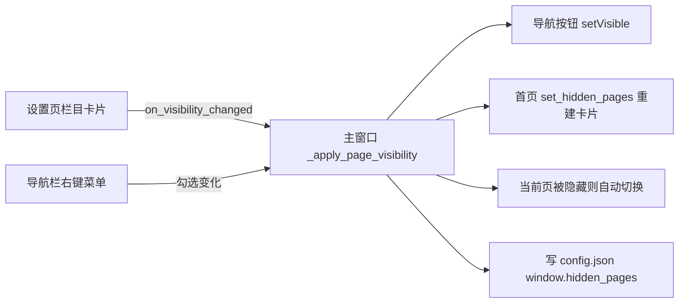

## 产品概述
在 PyQt6 桌面工具"工作助手"上实现三项增强：可选择性隐藏左侧导航栏目；针对 Win10/Win11 双系统环境提升兼容性与启动速度；整体界面升级为 macOS 风格的精美 UI（借鉴苹果系统设置/访达的视觉语言，仍是 Windows 桌面软件）。

## 核心功能
- 栏目隐藏：系统设置页新增「栏目显示」卡片，勾选框控制每个栏目显隐，勾选变化即时生效并持久化；左侧导航栏空白处右键弹出菜单快速切换；首页快捷入口卡片与导航栏同步隐藏；首页概览、系统设置两个基础栏目固定显示不可隐藏；隐藏当前正在显示的栏目时自动跳转到第一个可见栏目；隐藏状态存入 config.json 的 window.hidden_pages，重启后保持
- 兼容性：Win10/Win11 各缩放比例（125%/150%/200%）下界面清晰不模糊；无微软雅黑字体的英文系统自动回退字体；低于 Win10 1809 的过旧系统启动时温和提示不阻止运行；不改动已验证的 VC 运行库打包流程
- 启动提速：重模块（AI 客户端、腾讯文档 SDK 等）延迟到用户首次打开对应页面时才加载，窗口显示时间明显缩短
- 界面美化：全局应用 macOS 风格主题（accent 蓝 #007AFF、浅灰背景、大圆角卡片、胶囊导航选中态、细条滚动条），导航栏与首页卡片精致化，各功能页面结构不动仅跟随全局主题

## 约束
- 零新依赖（纯 QSS + Qt 内置能力），符合用户"不自造轮子"偏好
- 配置实时生效不弹窗；兼容现有 config.json（隐藏配置缺省空 = 全部显示，向后兼容）


## 技术栈
沿用现有 PyQt6 6.4.2 + ConfigManager（config.json）架构，Python 3.9.0，零新依赖。UI 通过纯 QSS 实现 macOS 风格。

## 实现方案
### 一、栏目隐藏（配置驱动 + 主窗口统一应用）
- 配置：`window.hidden_pages` 数组存栏目**名称**（如 ["串口调试"]），缺省空 = 全部显示，向后兼容；读 `get_window_config().get("hidden_pages", [])`，写 `set_value("window.hidden_pages", hidden)` + `save_config()`
- 主窗口唯一应用入口 `_apply_page_visibility(hidden)`：遍历 nav_buttons 按名称 `setVisible(name not in hidden)`；索引 0（首页）/6（系统设置）强制可见；若当前页被隐藏则切到第一个可见索引；HomePage 已创建则同步 `set_hidden_pages(hidden)`；initUI 末尾调用一次使启动即生效
- 右键菜单：`nav_frame.setContextMenuPolicy(CustomContextMenu)` + `customContextMenuRequested` → QMenu，每栏目一个 checkable QAction（0/6 锁定禁用），勾选变化即更新 hidden 列表、写配置、调 `_apply_page_visibility`
- `_page_factories[6]` 改为 `lambda: SettingsPage(on_visibility_changed=self._apply_page_visibility, nav_items=self.nav_items)`，栏目数据单点维护不重复硬编码
- 设置页左列新增「栏目显示」卡片（CARD_STYLE）：每栏目一个 QCheckBox（0/6 禁用并标注"固定显示"）；`_load_from_config` 读取勾选态必须 blockSignals；任一勾选变化：收集未勾选名称 → 写配置 → 回调主窗口实时刷新
- 首页 `set_hidden_pages(hidden)`：grid 提升为实例属性，按 `_TOOLS` 过滤重建，旧卡片必须 `hide() + setParent(None) + deleteLater()` 三连删除（Qt 坑）

### 二、启动提速（页面延迟导入）
- main_window.py 顶部删除 7 个页面模块 import；`_page_factories` 改为统一辅助工厂 `_page_factory(module, cls, **kwargs)`（`importlib.import_module` + `getattr`，避免 lambda 闭包陷阱），首次切换页面才加载
- 收益：text_polish_page / power_conversion_page / settings_page 连带 import 的 `deepseek_client`、`tencent_docs`（含 requests 重依赖）不再阻塞启动
- 首页虽启动即创建，同样走延迟导入（首个访问必然立即触发，无额外开销）；复杂度 O(n)（n=7），无缓存需求

### 三、兼容性（Win10/Win11）
- DPI：main() 中在 `QApplication(sys.argv)` **创建前**调用 `QGuiApplication.setHighDpiScaleFactorRoundingPolicy(Qt.HighDpiScaleFactorRoundingPolicy.PassThrough)`，支持 125%/150%/200% 非整数缩放清晰
- 字体回退：QApplication 后检测 `QFontDatabase.families()` 是否含 "Microsoft YaHei"，无则回退 "Segoe UI"，`app.setFont` 全局兜底（与 theme.system_font 统一，见方案四）
- 系统版本：`sys.getwindowsversion()` 读取 build，低于 10.0.17763（Win10 1809，Qt6 官方最低支持）时 QMessageBox 温和提示"建议升级系统"，仅提示不阻止运行
- 打包文档：README.md 注明 onedir（dist\工作助手）启动快、onefile（dist\工作助手_单文件）含解压开销，追求速度优先 onedir；**不改动** build_exe*.bat（GBK 编码）与 scripts/update_vc_runtime.bat（已验证的 VC 运行库修复流程）

### 四、macOS 风格 UI 美化（新建 app/core/theme.py）
- 新建 `app/core/theme.py`：调色板 accent #007AFF / hover #0A84FF / pressed #0060DF、窗口背景 #F2F3F5、卡片纯白、文字 #1D1D1F / 次级 #6E6E73、分隔线 #E5E5EA；GLOBAL_QSS 常量覆盖 QMenu / QScrollBar（细条 8px 圆角）/ QToolTip / QMessageBox / QSplitter / QComboBox 下拉 / QCheckBox / QRadioButton（accent 勾选色）/ QLineEdit / QSpinBox 聚焦蓝环 / QPushButton 兜底；`system_font()` 优先 "Microsoft YaHei UI" → "Microsoft YaHei" → "Segoe UI"；`apply_theme(app)` 统一 `app.setFont(system_font())` + `app.setStyleSheet(GLOBAL_QSS)`
- main_window.py 导航栏 macOS 侧边栏化：navFrame 白底 + 细分隔线；按钮 hover 浅灰胶囊、选中态 accent 浅蓝底 + 左侧 3px 圆角指示条 + accent 色字（替代整块蓝底白字，借鉴 Finder/系统设置）；标题加字距；窗口背景 #F2F3F5；apply_styles 改为调用 apply_theme
- home_page.py 首页卡片精致化：圆角 14px、hover 边框 accent + 背景微亮 + 微上浮（QSS border 模拟，不用 QGraphicsDropShadowEffect 真实投影，避免 Win10 低端机大量控件阴影的性能开销）；欢迎语/副标题用 system_font 与更柔和字色
- 已局部定制页面（设置页/烧录页等）结构不动，仅跟随全局背景/字体；局部 QSS 优先于全局，无冲突

## 架构设计
### 数据流

- 主题架构：`app/core/theme.py` 集中维护 macOS 调色板 + 全局 QSS + 字体策略，main() 启动时 apply_theme 一次，各页面硬编码的局部 QSS 优先级高于全局，无需逐一改造

## 目录结构
```
app/
├── main_window.py          # [MODIFY] 隐藏栏目读取/应用/自动跳转/右键菜单/持久化；页面延迟导入；DPI/字体/系统版本；导航栏 macOS 化；接入 apply_theme
├── core/
│   └── theme.py            # [NEW] macOS 风格主题：调色板 + GLOBAL_QSS + system_font() + apply_theme()
├── pages/
│   ├── settings_page.py    # [MODIFY] 新增「栏目显示」卡片（QCheckBox 列表，勾选即保存并回调主窗口）
│   └── home_page.py        # [MODIFY] set_hidden_pages(hidden) 过滤重建卡片 + 卡片精致化
README.md                   # [MODIFY] 补充 onedir/onefile 启动速度差异与主题说明（纯文档）
config.json                 # [运行时] window.hidden_pages 由程序自动写入，无需手工编辑
```

## 实现注意
- 复选框与 QAction 初始化设置勾选态必须 blockSignals，防止加载阶段误触发保存回调
- 首页卡片重建遵守 Qt 坑：旧卡片 hide() + setParent(None) + deleteLater() 三连
- DPI 策略必须在 QApplication 创建前设置，否则不生效
- 不触碰已验证的打包/VC 运行库流程；日志复用现有 logger 不新增；系统版本提示用 QMessageBox 温和提示不阻止运行
- 性能：隐藏操作 O(n)（n=7 栏目）；启动延迟导入消除重模块阻塞；美化用 QSS 而非真实投影，避免低端机渲染开销


## 设计风格
借鉴苹果 macOS 系统界面（系统设置/访达）的视觉语言，应用于 Windows 桌面软件，营造精致、克制、清爽的质感：
- 主题：浅色磨砂感界面，大面积浅灰背景（#F2F3F5）衬托纯白卡片，层次分明
- 导航：左侧边栏白色底 + 细分隔线；按钮常态透明、hover 浅灰胶囊、选中态 accent 浅蓝底 + 左侧 3px 圆角指示条 + accent 色文字，替代传统整块实心蓝底白字，视觉更轻盈
- 卡片：14px 大圆角、1px 浅边框、hover 时边框变 accent 蓝 + 背景微亮 + 轻微上浮（QSS 模拟，保证低配 Win10 流畅）
- 交互：滚动条细条化（8px 圆角、hover 增宽）、下拉菜单/提示框统一圆角与 hover 反馈、输入框聚焦出现 accent 蓝环
- 布局：保持现有两栏/卡片布局不变，仅升级视觉皮肤；窗口背景、标题、分隔线全局统一

## Agent Extensions
### SubAgent
- **code-explorer**
  - Purpose: 端到端验证阶段跨文件排查改动影响面——SettingsPage 构造签名变更、main_window 导入结构调整、theme.py 新增后，全仓库（含 scripts、README、入口 main.py）是否存在遗漏调用点或残留旧式调用
  - Expected outcome: 确认无残留 `SettingsPage()` 无参调用、无顶层页面导入遗漏，重构后代码可运行
### Skill
- **lsp-code-analysis**
  - Purpose: 语义级校验符号引用——`_page_factories` 各 lambda 与 `_page_factory` 辅助函数、`switch_page`/`_ensure_page` 调用链、`apply_theme`/`system_font` 接入点、`_apply_page_visibility`/`set_hidden_pages`/`on_visibility_changed` 引用完整性
  - Expected outcome: 通过定义/引用/调用层级分析确认改动无破坏性引用，新主题函数与隐藏栏目方法覆盖范围明确
