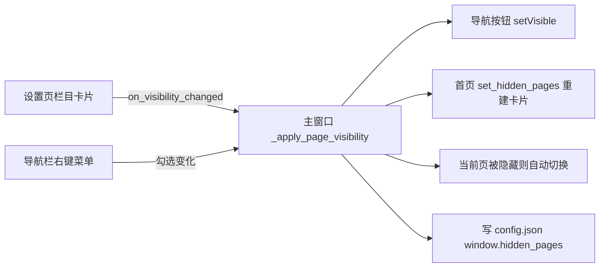

## 产品概述
在 PyQt6 桌面工具"工作助手"上新增栏目显隐管理功能：隐藏不常用的左侧导航栏目，同时针对 Win10/Win11 双系统环境提升兼容性与启动速度。

## 核心功能
- 系统设置页新增「栏目显示」卡片：每个栏目一个勾选框，勾选变化即时生效并持久化，无需额外点保存
- 左侧导航栏空白处右键弹出菜单：checkable 勾选快速切换栏目显示状态
- 首页快捷入口卡片与导航栏同步：被隐藏栏目的卡片不再显示
- 隐藏状态持久化到 config.json（window.hidden_pages），重启后保持
- 首页概览、系统设置两个基础栏目固定显示，不可隐藏（防止失去管理入口）
- 隐藏当前正在显示的栏目时，自动跳转到第一个可见栏目
- 兼容性：Win10/Win11 各缩放比例下界面清晰不模糊；无微软雅黑字体的系统自动回退；过旧系统（低于 Win10 1809）启动时温和提示
- 性能：启动提速——重模块（AI 客户端、腾讯文档等）延迟到用户首次打开对应页面时才加载


## 技术栈
沿用现有 PyQt6 + ConfigManager（config.json）架构，不引入新依赖。UI 沿用现有卡片式风格（白底圆角 + 主色 #409EFF）。

## 实现方案
### 总体策略
配置驱动 + 主窗口统一应用：隐藏栏目列表存于 `window.hidden_pages`（数组，存栏目**名称**，缺省空=全部显示，向后兼容）。主窗口提供唯一应用入口 `_apply_page_visibility(hidden)`，负责导航按钮可见性、首页卡片同步、当前页被隐藏时自动切换。设置页卡片与导航栏右键菜单是两个写入入口，均调用同一逻辑，保证双入口一致。

### 关键设计
1. **主窗口（app/main_window.py）**
   - 数据读写：`self._cfg.get_window_config().get("hidden_pages", [])` 读取；`self._cfg.set_value("window.hidden_pages", hidden)` + `save_config()` 写入
   - `_apply_page_visibility(hidden)`：遍历 `nav_buttons` 按名称 `setVisible(name not in hidden)`；索引 0（首页）/6（系统设置）强制可见；若当前 `stacked_widget.currentWidget()` 对应栏目被隐藏则切到第一个可见索引；若 HomePage 已创建则同步调用 `set_hidden_pages(hidden)`；`initUI` 末尾调用一次使启动即生效
   - 右键菜单：`nav_frame.setContextMenuPolicy(CustomContextMenu)` + `customContextMenuRequested` → QMenu，每栏目一个 checkable QAction（首页/系统设置 `setEnabled(False)` 锁定），勾选变化即更新 hidden 列表、写配置、调 `_apply_page_visibility`
   - `_page_factories[6]` 改为传入 `SettingsPage(on_visibility_changed=self._apply_page_visibility, nav_items=self.nav_items)`，栏目数据单点维护不重复硬编码
2. **设置页（app/pages/settings_page.py）**：左列新增「栏目显示」卡片（CARD_STYLE），每栏目一个 QCheckBox（首页/系统设置禁用并标注"固定显示"）；`_load_from_config` 读取 hidden 设置勾选态（**blockSignals 防误触发**）；任一勾选变化：收集未勾选名称 → 写配置 → `on_visibility_changed(hidden)` 回调主窗口实时刷新
3. **首页（app/pages/home_page.py）**：`__init__` 增加 `hidden_pages=()` 参数；`_setup_ui` 中 grid 提升为实例属性；新增 `set_hidden_pages(hidden)` 按 `_TOOLS` 过滤重建卡片（旧卡片必须 `hide() + setParent(None) + deleteLater()` 三连，否则残留画面）

### 启动提速（关键性能优化）
- `main_window.py` 顶部删除 7 个页面模块 import，`_page_factories` 的 lambda 内部延迟 `from app.pages.xxx_page import XxxPage`（首次切换才加载）
- 收益：`text_polish_page`/`power_conversion_page`/`settings_page` 连带 import 的 `deepseek_client`、`tencent_docs`（含 requests 等重依赖）不再阻塞启动，窗口显示时间明显缩短
- 实现用统一辅助工厂 `_page_factory(module, cls, **kwargs)`（内部 `importlib.import_module` + `getattr`），避免 lambda 闭包陷阱；首页虽启动即创建，同样走延迟导入（首个访问必然立即触发，无额外开销）
- 复杂度 O(n)（n=7 栏目），无缓存需求

### 兼容性处理（Win10/Win11）
- **DPI 缩放**：`main()` 中在 `QApplication(sys.argv)` **创建前**调用 `QGuiApplication.setHighDpiScaleFactorRoundingPolicy(Qt.HighDpiScaleFactorRoundingPolicy.PassThrough)`，支持 125%/150%/200% 等非整数缩放比例下文字清晰不模糊（Qt6 默认开启高分屏，PassThrough 提供小数缩放最佳体验）
- **字体回退**：`QApplication` 创建后检测 `QFontDatabase.families()` 是否含 "Microsoft YaHei"，无则回退 "Segoe UI" 并 `app.setFont(...)` 全局兜底；不逐一修改各页面硬编码 `QFont("Microsoft YaHei", n)`（改动面小、风险低，Qt 对缺失字体会自动替换）
- **系统版本检测**：`sys.getwindowsversion()` 读取 build，低于 10.0.17763（Win10 1809，Qt6 官方最低支持）时 QMessageBox 温和提示"建议升级系统"，仅提示不阻止运行
- **打包文档**：README.md 注明 onedir（dist\工作助手）启动快、onefile（dist\工作助手_单文件）含解压开销，追求速度优先 onedir；**不改动** `build_exe*.bat`（保持 GBK 编码）与 `scripts/update_vc_runtime.bat`（已验证的 VC 运行库修复流程）

## 架构设计
### 数据流


## 目录结构
```
app/
├── main_window.py          # [MODIFY] 隐藏栏目读取/应用/自动跳转/右键菜单/持久化；页面延迟 import；DPI 策略；字体回退；系统版本提示
├── pages/
│   ├── settings_page.py    # [MODIFY] 新增「栏目显示」卡片（QCheckBox 列表，勾选即保存并回调主窗口）
│   └── home_page.py        # [MODIFY] 新增 set_hidden_pages(hidden) 过滤重建工具卡片网格
README.md                   # [MODIFY] 补充 onedir/onefile 启动速度差异说明（纯文档）
config.json                 # [运行时] window.hidden_pages 由程序自动写入，无需手工编辑
```

## 实现注意
- 复选框与 QAction 初始化设置勾选态必须 `blockSignals`，防止加载阶段误触发保存回调
- 首页卡片重建遵守 Qt 坑：旧卡片 `hide() + setParent(None) + deleteLater()` 三连
- 隐藏页面若已懒加载创建，仅隐藏导航入口，页面对象保留无副作用；`switch_page` 索引逻辑不变
- DPI 策略必须在 QApplication 创建前设置，否则不生效
- 不触碰已验证的打包/VC 运行库流程；日志复用现有 logger 不新增


## Agent Extensions
### SubAgent
- **code-explorer**
  - Purpose: 端到端验证阶段跨文件排查改动影响面——SettingsPage 构造签名变更、main_window 导入结构调整后，全仓库（含 scripts、README、入口 main.py）是否存在遗漏调用点
  - Expected outcome: 确认无残留旧式 `SettingsPage()` 无参调用、无顶层页面导入遗漏，保证重构后代码可运行
### Skill
- **lsp-code-analysis**
  - Purpose: 语义级校验符号引用——`_page_factories` 各 lambda、`switch_page`/`_ensure_page` 调用链、`QFont("Microsoft YaHei")` 使用范围、`hidden_pages` 相关方法的引用完整性
  - Expected outcome: 通过定义/引用/调用层级分析确认改动无破坏性引用，字体回退方案覆盖范围明确
